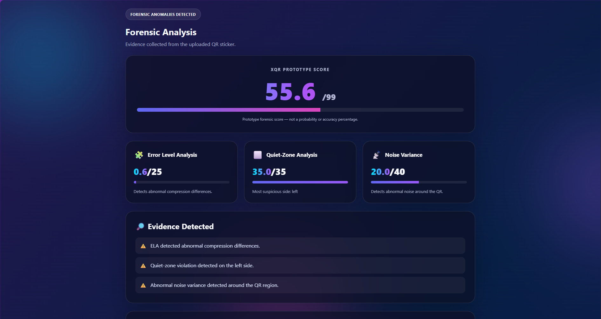
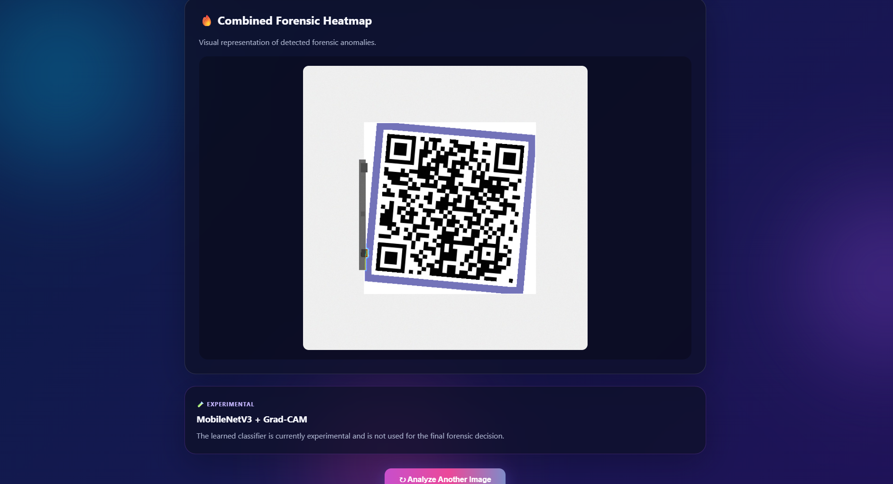

# 🔐 XQR FOR MERCHANTS

### An Explainable Tamper-Detection Framework for Small Business UPI Payments

<p align="center">


</p>

<p align="center">
  <b>Detect suspicious QR-code sticker tampering using computer vision, image forensics, and explainable analysis.</b>
</p>

XQR FOR MERCHANTS is a prototype digital-forensics system designed to detect possible tampering around physical QR-code payment stickers used by small businesses.

The system combines computer vision, digital image forensics, machine learning, and explainable analysis to identify suspicious visual and compression-related anomalies around QR codes.

> **Note:** XQR is a research prototype. Its forensic score represents detected image anomalies and is not a probability of fraud or proof that fraud has occurred.

---

## 🖥️ Web Application Demo

XQR includes an interactive Flask web application for analyzing QR-code images and presenting explainable forensic evidence.

### Forensic Analysis Result

The interface displays the prototype forensic score together with individual evidence scores from ELA, quiet-zone analysis, and noise variance analysis.

<p align="center">
  
</p>

### Combined Forensic Heatmap

The combined heatmap provides a visual representation of image regions contributing to the detected forensic anomalies.

<p align="center">
  
</p>

> **Demo note:** The screenshots above show a live application result. The displayed forensic score is an anomaly score, not a probability of fraud or a statistical accuracy measurement.

---

## 🔍 Problem Statement

Physical QR-code payment stickers can potentially be replaced, covered, modified, or tampered with.

A customer may scan a QR code without noticing that the displayed payment destination has been changed.

XQR FOR MERCHANTS explores whether image-forensic techniques can help identify suspicious modifications around physical QR-code payment stickers.

---

## ✨ Key Features

* QR-code localization using YOLOv8
* QR boundary refinement using OpenCV
* Error Level Analysis (ELA)
* Quiet-zone violation detection
* Noise variance analysis
* Weighted forensic score fusion
* Combined forensic heatmap
* Experimental MobileNetV3 classification
* Experimental Grad-CAM explainability
* Interactive Flask web application
* Drag-and-drop image upload
* Visual forensic results
* Evidence-based explanation of detected anomalies

---

## 🧠 System Pipeline

```text
                 Input QR Image
                       │
                       ▼
              YOLOv8 QR Localization
                       │
                       ▼
              QR Boundary Refinement
                       │
                       ▼
          ┌──────────────────────────┐
          │    Forensic Analysis     │
          ├──────────────────────────┤
          │                          │
          │  ELA Analysis            │
          │  Quiet-Zone Analysis     │
          │  Noise Variance          │
          │                          │
          └──────────────────────────┘
                       │
                       ▼
                  Score Fusion
                       │
                       ▼
                XQR Forensic Score
                       │
              ┌────────┴────────┐
              ▼                 ▼
          Evidence         Heatmap
```

---

## 🔬 Forensic Analysis

### 1. Error Level Analysis (ELA)

Error Level Analysis examines differences produced when an image is recompressed.

Unusual compression differences around the QR region may indicate that different areas of the image have different editing or compression characteristics.

**Maximum contribution: 25 points**

---

### 2. Quiet-Zone Analysis

QR codes require a clear area around their boundary called the **quiet zone**.

XQR examines the area surrounding the detected QR code and checks for abnormal dark pixels or possible boundary violations.

**Maximum contribution: 35 points**

---

### 3. Noise Variance Analysis

Different physical and digital regions can contain different noise characteristics.

XQR calculates local image variance around the QR region to identify unusual noise patterns.

**Maximum contribution: 40 points**

---

## 📊 XQR Forensic Score

The three classical forensic modules are combined to produce the prototype XQR score:

```text
XQR Score =
    ELA Score
  + Quiet-Zone Score
  + Noise Variance Score
```

The prototype uses a maximum displayed score of **99**.

The score represents the strength of detected forensic anomalies.

It is **not**:

* A probability of fraud
* A percentage chance of fraud
* Proof of malicious activity
* Proof that a payment is fraudulent
* A measure of financial loss

---

## 🔥 Explainable Heatmap

XQR generates a combined forensic heatmap showing image regions that contributed to the forensic analysis.

This provides visual evidence of where potential anomalies were detected instead of providing only a numerical score.

---

## 🤖 Machine Learning Components

### YOLOv8

YOLOv8 is used to locate the QR code within the uploaded image.

The detector was trained using a controlled synthetic dataset.

Controlled validation results:

```text
Precision:     0.998
Recall:        1.000
mAP@50:        0.995
mAP@50-95:     0.995
```

These results are based on the controlled dataset and should not be interpreted as real-world performance.

---

### MobileNetV3

MobileNetV3 was implemented as an experimental classification layer for distinguishing genuine and tampered QR samples.

The current dataset is limited and the classifier showed unstable behavior during controlled testing.

Therefore, MobileNetV3 is currently treated as an **experimental component** rather than the primary forensic decision-maker.

---

### Grad-CAM

Grad-CAM was implemented to visualize regions influencing the MobileNetV3 classification.

Initial controlled testing showed that the current classifier did not consistently focus on the actual tampered region.

Therefore, Grad-CAM is currently considered an **experimental explainability component** requiring further validation.

---

## 🧪 Controlled Forensic Evaluation

The classical forensic pipeline was tested using a controlled genuine/tampered image pair.

### Genuine Sample

```text
ELA:              0 / 25
Quiet Zone:       0 / 35
Noise Variance:   0 / 40

XQR Score:        0 / 99

Result:
NO FORENSIC ANOMALIES DETECTED
```

### Tampered Sample

```text
ELA:             10 / 25
Quiet Zone:      35 / 35
Noise Variance:  40 / 40

XQR Score:       85 / 99

Result:
FORENSIC ANOMALIES DETECTED
```

The controlled evaluation produced an **85-point separation** between the genuine and tampered samples.

Because this evaluation uses a controlled sample pair rather than a large independent dataset, the result should not be considered a statistical accuracy measurement.

---

## 🌐 Web Application

XQR includes an interactive Flask web application.

The web interface allows users to:

1. Upload a QR-code image
2. Preview the image
3. Start forensic analysis
4. View the XQR forensic score
5. View individual module scores
6. View detected evidence
7. View the combined forensic heatmap

The interface includes animated visual elements, loading indicators, score bars, and an interactive result display.

---

## 🛠️ Technologies Used

* Python
* Flask
* OpenCV
* NumPy
* Pillow
* PyTorch
* Torchvision
* Ultralytics YOLOv8
* MobileNetV3
* Grad-CAM
* HTML
* CSS
* JavaScript

---

## 📁 Project Structure

```text
XQR-FOR-MERCHANTS/
│
├── app.py
├── data.yaml
├── evaluate_controlled.py
├── test_classifier.py
├── test_gradcam.py
│
├── README.md
├── requirements.txt
├── .gitignore
│
├── data/
│   ├── genuine/
│   └── tampered/
│
├── dataset/
│   ├── images/
│   │   ├── train/
│   │   └── val/
│   └── labels/
│       ├── train/
│       └── val/
│
├── dataset_classification/
│   ├── train/
│   │   ├── genuine/
│   │   └── tampered/
│   └── val/
│       ├── genuine/
│       └── tampered/
│
├── docs/
│
├── model/
│   └── mobilenetv3_xqr.pth
│
├── results/
│   ├── evaluation/
│   │   └── controlled_evaluation.txt
│   ├── heatmaps/
│   └── reports/
│       ├── genuine_01_report.txt
│       └── tampered_01_report.txt
│
├── src/
│   ├── classification/
│   │   └── mobile_classifier.py
│   │
│   ├── explainability/
│   │   └── grad_cam.py
│   │
│   ├── forensics/
│   │   ├── combined_heatmap.py
│   │   ├── ela.py
│   │   ├── fusion.py
│   │   ├── margin.py
│   │   ├── noise_variance.py
│   │   ├── quiet_zone.py
│   │   └── refine_qr.py
│   │
│   ├── preprocessing/
│   │   └── yolo_detector.py
│   │
│   ├── create_test_pair.py
│   ├── generate_classification_dataset.py
│   ├── generate_yolo_dataset.py
│   ├── main.py
│   ├── prepare_yolo_dataset.py
│   └── train_classifier.py
│
├── tests/
│   ├── test_margin.py
│   ├── test_quiet_location.py
│   ├── test_quiet_margins.py
│   ├── test_quiet_zone_visual.py
│   ├── test_refine_qr.py
│   └── test_yolo_detector.py
│
└── web/
    ├── index.html
    ├── script.js
    └── style.css
```

### Files intentionally excluded from the repository

The following local/generated files are excluded using `.gitignore`:

* `venv/` — Python virtual environment
* `.venv/` — alternative virtual environment
* `runs/` — YOLO training and prediction outputs
* `web/uploads/` — uploaded images
* `__pycache__/` — Python cache files
* `*.pyc`, `*.pyo` — Python compiled files
* `.env` — environment variables/secrets
* `.vscode/` — local editor settings
* `.pytest_cache/` — pytest cache
* `*.cache` — generated YOLO cache files
* `yolov8n.pt` — pretrained YOLOv8 model weights

---

## ⚙️ Installation

### 1. Clone the repository

```bash
git clone https://github.com/Fio-achsha4/XQR-FOR-MERCHANTS.git
cd XQR-FOR-MERCHANTS
```

### 2. Create a virtual environment

```bash
python -m venv venv
```

### 3. Activate the environment on Windows

```bash
venv\Scripts\activate
```

### 4. Install dependencies

```bash
pip install -r requirements.txt
```

---

## ▶️ Running the Web Application

From the project root:

```bash
python app.py
```

The application will be available at:

```text
http://127.0.0.1:5000
```

Open the address in your browser.

Upload a QR-code image and start the forensic analysis.

---

## 💻 Command-Line Analysis

The original command-line interface can also be used:

```bash
python src/main.py
```

The program will request the path to an image for analysis.

---

## 📋 Evaluation Script

The controlled forensic evaluation can be run using:

```bash
python evaluate_controlled.py
```

The evaluation report is saved in:

```text
results/evaluation/controlled_evaluation.txt
```

---

## ⚠️ Limitations

XQR FOR MERCHANTS is currently a research prototype.

Important limitations include:

* Limited controlled dataset
* Synthetic training data
* Limited real-world evaluation
* Controlled forensic evaluation uses a small number of samples
* Image quality can affect forensic measurements
* Lighting conditions can affect image analysis
* Camera characteristics can affect results
* Image compression can affect ELA results
* MobileNetV3 requires further training and validation
* Grad-CAM requires further validation
* A detected image anomaly does not automatically mean fraud occurred

---

## 🚀 Future Work

Future development may include:

* Larger real-world QR datasets
* More diverse tampering scenarios
* Improved MobileNetV3 training
* Better Grad-CAM localization
* More robust threshold calibration
* Multi-class tampering detection
* Real-time camera analysis
* Mobile deployment
* Merchant-side QR verification
* Improved explainability
* Larger statistical evaluation
* Automated batch evaluation
* Real-world merchant testing

---

## 🔮 Research Direction

XQR FOR MERCHANTS explores the combination of:

```text
Computer Vision
       +
Digital Image Forensics
       +
Machine Learning
       +
Explainable AI
       =
QR Tamper Detection
```

The project investigates whether these techniques can provide understandable forensic evidence for physical QR-payment stickers.

---

## 🎯 Project Goal

The long-term goal of XQR FOR MERCHANTS is to explore a practical and explainable approach for identifying suspicious modifications to physical QR payment stickers.

Instead of relying only on a black-box prediction, the system attempts to provide:

```text
Detection
   +
Forensic Evidence
   +
Visual Explanation
```

This makes the approach suitable for research into explainable digital forensics.

---

## 📜 Disclaimer

XQR FOR MERCHANTS is an educational and research prototype.

The system detects image-level forensic anomalies and does not independently verify the identity of a payment recipient, determine whether a transaction is fraudulent, or establish malicious intent.

Results should be interpreted together with other evidence.

---

## 👩‍💻 Author

Developed as a Cyber Security and Digital Forensics project exploring explainable QR-code tamper detection.

**GitHub:**
https://github.com/Fio-achsha4/XQR-FOR-MERCHANTS
